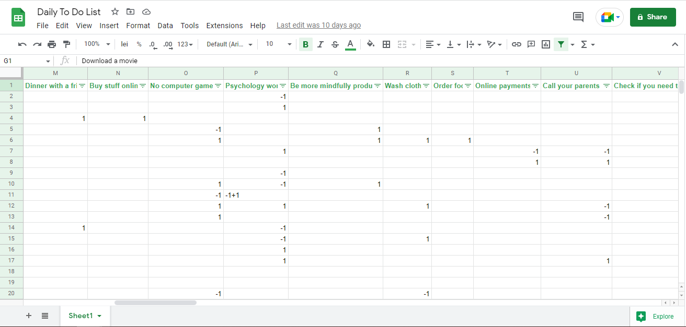

<h1 style="text-align: center"> Daily to do list 📝  - Exploratory Data Analysis </h1>

## Business Case

What I wanted to do is have an overview of what kind of tasks I tend to do and what kind of tasks I tend not to.
In this way this project should function as an "external introspection". Because I had initially put up a system 
of to do lists that I have for over a year now, this gives me plenty of data to extract some statistics from.

The kind of work you tend to do more on a daily basis shapes you. Therefore I was curious to see my habits. 
From there I could design a new system to help me improve in areas where I lack consistency.

The main goal here was to extract interesting and telling insights from this data, and, based on them, draw 
conclusions on what can be improved. I do not deny that giving myself a pat on the back for tasks I thrive with
was also a reason. I wanted to extract statistics and visuals that would give me the leverage to do that.

A more formal problem definition and summary was given in the [jupyter notebook](./EDA%20To%20Do%20List.ipynb) associated to this project.

## Table of Contents

Show/Hide

1. [File/Folder descriptions](#1-filefolder-descriptions)
2. [Data preparation](#2-data-preparation)
3. [Exploratory Data analysis](#3-exploratory-data-analysis)
    * [3.1 What we search for](#31-what-we-search-for)
    * [3.2 Extracting the statistics](#32-extracting-the-statistics)
4. [Conclusion](#4-conclusion)
    * [4.1 What did I learn?](#41-what-did-i-learn)
    * [4.2 Future improvements](#42-future-improvements)

## 1. File/Folder descriptions

* data: this is a folder containing all of the Data
    * initial_data: a folder which contains the excel file containing raw data
    * dated folders: folders created on the date of their name as a result of running the notebook; these folders contain images and text files on which to conclude an analysis of the task habits
* images: folder which contained images used in the README
* EDA To Do List.ipynb: the jupyter notebook containing all the logic
* Daily "to do"s - an insight.pdf: a presentation that I created for myself as an exercise to create a presentation for stakeholders on future projects
* requirements.txt: all the libraries used in the jupyter notebook

## 2. Data preparation

What I had to begin with was just sheets of paper, each of them dated and containing
tasks that were checked as done or not done. So I had to decide how to approach getting
them into my computer.

First idea was, of course, manual labour. Then I thought: maybe I could use some form of character
recognition and then use machine learning to split them into groups. But when I thought about it,
I remembered that I did not build this to do list system with the intention of doing anything with it.
Therefore I had no categories, just tasks. I decided that manually transcribing was my best bet, since
I could see the tasks and categorize them myself. I also had to think of a system to track tasks within
a day that were of the same category, some finished and some unfinished.

I used Google Sheets to make it easier for me to find categories and such and this was the results I came to:

 
 

Getting the right format of data was interesting to do, because what I wanted to achieve
in the end was the "success level" of the day. This was the number of tasks I have succeeded
to do over the number of tasks I have planned to do. So categories that contain -x+y means that
x tasks from that category did not succeed, while y did. And that there were a total of (x+y) 
tasks in that category that day.

Info about data preprocessing and getting to a reasonable data format to use within the code is
available in the notebook.

## 3. Exploratory data analysis

This was the main idea of the project. What can the data tell me about the tasks that I have noted?
For this to work, I had to come up with statistics I would like to see based on how I defined the 
data in the preprocessing step.

### 3.1 What we search for

This was a brainstorming step. I would think about the data structure and how I can mold it to tell me specific things.

Ideas that I believed were important and/or interesting are:
- tasks with most probability to fail
- tasks with most probability to succeed
- descriptive statistics about day success (IQR, median etc.)
- total success rate per each category
- productivity rates in time
- heatmap for numerical values
- plot success rate against number of tasks
- define categories: quick, get_out_of_house, cleaning, work, physical, reading, mentality_of_day, talk_to_people
and for each plot boxplots with success rate to see which activities you are most likely to do

These are some of the things I wanted to see. All that I initially wanted to see is well documented in the notebook.

### 3.2 Extracting the statistics

Some of the statistics were relevant number-wise

<h5 align="center">Productivity per day statistics</h5>

  

 
 

while others were more interesting to visualize as graphs

<h5 align="center">Productivity per category</h5>

  

 
 

## 4. Conclusion

There were great insights into my own organization whereabouts. This was all summarized in a
[presentation](./Daily%20“to%20do”s%20-%20an%20insight.pdf) I created for myself. As I have done in the notebook, I will list some of the things I have learnt here.

### 4.1 What did I learn?

Firstly and most importantly, there were tasks which I consistently wanted to do and did not succeed (most of the time) in doing them.
The solution for "curing" this would be to take one of these tasks and focus (almost) daily on it. This would in turn build a habit. 
When I am comfortable that I can succeed in this task on a daily basis, I can go ahead and repeat this process with the next such task.

Another interesting fact is that there were relatively easy to do tasks (do not take a lot of time) that were mostly missed because of 
how I organized my day. This made me be more aware of my **actual** time within a day and plan accordingly.

This is an out of data scope insight, but I see that when I do make these lists, I tend to get more done. So I will continue to create
them. And I will also have a weekly paper to computer session when I transcribe to do lists from previous week. This will also hold me
accountable to update this project and see how my behaviour changes.

### 4.2 Future improvements

There are some things that I would like to have in the future.

- Have a script to run the jupyter notebook (and generate all the useful data) for data between 2 certain dates. This way I can track progress along time frames and not necessarily between start and current time.
- Come up with more statistics to see. I am sure there are insights I have missed. But if in the future I can come back to this project with a fresh perspective I am sure I can come up with more useful insights to extract.
- See if I can come up with some features for modelling and see if there's a day formula for guaranteed success.
